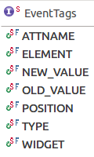
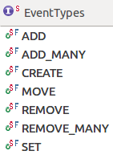

== Extract event information

=== Available event tags

<<<<<<< Upstream, based on branch 'master' of https://github.com/vogellacompany/com.vogella.tutorials.eclipse
The `UIEvents.EventTags` interface define the possible event tags:

These event tags are explained in the following sections.

=== ATTNAME event tag

The `ATTNAME` property of the event is the attribute of the model, which has been changed.

So if you for instance listen to changes of a model element's label, the `ATTNAME` of the event will be `label`.

[source,java]
----
include::res/attname_label.java[]
----

image::./images/label_attname.png[Label ATTNAME]

NOTE: The `label` 	is an XML attribute and can be found is the source of your _Application.e4xmi_ file.

[source, xml]
----
<children xsi:type="basic:Part" xmi:id="_9CJOwNgYEeKX2Jv3m0M6IA"
						elementId="com.sample.application.part.attname"
						contributionURI="bundleclass://com.sample.application/yourpackage.attname"
						label="ATTNAME sample
						label"/>
----

=== ELEMENT event tag

The `ELEMENT` event tag in general is the model element, which is concerned in the event.
For an example see <<active_sample_event>>

=== NEW_VALUE and OLD_VALUE event tags

The `NEW_VALUE` and `OLD_VALUE` properties contain the changed value of the element's attribute.

NOTE: In the old Eclipse 3.x days, you would have registered an `IPerspectiveListener` for the `WorkbenchWindow` and implement the `perspectiveChanged(...)` method.
But in Eclipse 4 you'd rather have to think in a DOM(Document Object Model) manner, where `<ELEMENT ATTNAME="NEW_VALUE">` are manipulated and fired within events.
		
A example for using the values of an attribute in the model is a listener for a perspective change.

[source,java]
----
include::res/perspective_stack_selected_element_event.java[]
----

In case you want to listen to a kind of "perspective changed" event, you need to listen to the change of the `selectedElement` attribute of the `MPerspectiveStack` and can get the new and old `MPerspective` from `EventTags.NEW_VALUE` and `EventTags.OLD_VALUE` properties.

So you actually listen to the changed `selectedElement` attribute value of the `MPerspectiveStack`, rather than looking for a "perspective change" event.

So it is good to keep the DOM structure of the application model in mind and think of the changes, which can occur within the application model.
		
=== TYPE event tag

With the `TYPE` event tag you may determine what action has been done to the application model.

The different types can be found in the `UIEvents.EventTypes` interface:

With these event types you are able to figure out, whether a model element was added, created, moved, removed or an attribute was set.

The `UIEvents` class, also offers convenience methods to check for some types.

image::./images/event_type_convenience.png[Convenience methods for event types.]

The `isADD(Event)` and `isREMOVE(Event)` methods apply for both single and many, e.g., ADD and ADD_MANY)

			For an example see <<position_event_tag>>

=== POSITION event tag

The _POSITION_ event tag contains the new position of model elements.
So this property is only set in case a collection of elements is concerned.

If you move parts in a MPartStack or between different MPartStacks, you can also listen to changes of the children of an element container like this:

[source,java]
----
include::res/position_event_tag.java[]
----

In case you drag and drop a `MPart` within a `MPartStack`, the `MPart` will be removed and afterwards added to the `MPartStack`.

The details can be seen in the `UIEventPublisher.formatData()` method from the `org.eclipse.e4.ui.internal.workbench` package, where the position on is only the for move, add or remove events.

=== WIDGET event tag

The _WIDGET_ event tag can be used to get the underlying widget, e.g., a `Composite`, of the model element, which is concerned in the event.

So you are also able to directly interact with the underlying widget. But in most cases this is not necessary, because the model elements themselves provide the most of the methods to interact with the widget, like `setLabel` or `setVisible` methods and so on.
=======
The
`UIEvents.EventTags`
interface define the possible event tags:

image::event_tags.png[EventTags interface with properties of an Event,pdfwidth=50%]

These event tags are explained in the following sections. 

=== ATTNAME event tag

The
`ATTNAME`
property of the event is the attribute of the model,
which has been changed.

So if you for instance listen to changes of a model element's label, the
`ATTNAME`
of the event will be
`label`.

[source,java]
----
include::res/attname_label.java[]
----

image::label_attname.png[Label ATTNAME]

[NOTE]
====
The `label`
is an XML attribute and can be
found is the source of your
_Application.e4xmi_
file.

[source]
----
&lt;children xsi:type="basic:Part" xmi:id="_9CJOwNgYEeKX2Jv3m0M6IA"
elementId="com.sample.application.part.attname"
contributionURI="bundleclass://com.sample.application/yourpackage.attname"
label="ATTNAME sample
label
----
====

=== ELEMENT event tag

The
`ELEMENT`
event tag in general is the model element, which is
concerned in the event. For an example see
<<active_sample_event>>

=== NEW_VALUE and OLD_VALUE event tags

The
`NEW_VALUE`
and
`OLD_VALUE`
properties
contain the changed value of the element's attribute.

NOTE:

In the old Eclipse 3.x days, you would have registered an
`IPerspectiveListener`
for the
`WorkbenchWindow`
and
implement the
`perspectiveChanged(...)`
method. But in Eclipse 4
you'd rather have to think in a DOM(Document Object Model) manner, where
<emphasis>&lt;ELEMENT ATTNAME="NEW_VALUE"></emphasis>
are manipulated and
fired within events.

A example for using the values of an attribute in the model is a listener for a
perspective change.

[source,java]
----
include::res/perspective_stack_selected_element_event.java[]
----

In case you want to listen to a kind of "perspective changed" event, you need to
listen to the change of the
`selectedElement`
attribute of the
`MPerspectiveStack`
and can get the new and old
`MPerspective`
from
`EventTags.NEW_VALUE`
and
`EventTags.OLD_VALUE`
properties.

So you actually listen to the changed
`selectedElement`
attribute
value of the
`MPerspectiveStack`
, rather than looking for a "perspective
change" event.

So it is good to keep the DOM structure of the application model in mind and think of
the changes, which can
occur within the application model.

=== TYPE event tag

With the
`TYPE`
event tag you may determine what action has been
done to the application model.

The different types can be found in the
`UIEvents.EventTypes`
interface:

<mediaobject>
<imageobject>
<imagedata fileref="./images/event_types.png[EventTypes interface for changes to the application model]

With these event types you are able to figure out, whether a model element was added,
created, moved, removed or
an attribute was set.

The
`UIEvents`
class, also offers convenience methods to check for some
types.

<mediaobject>
<imageobject>
<imagedata fileref="./images/event_type_convenience.png[Convenience methods for event types.]

The
`isADD(Event)`
and
`isREMOVE(Event)`
methods apply for both
single and many, e.g., ADD and ADD_MANY)

For an example see
<<position_event_tag>>

=== POSITION event tag

The
`POSITION`
event tag contains the new position of model
elements. So this property is only set in case a collection of elements
is
concerned.

If you move parts in a MPartStack or between different MPartStacks, you can also
listen to changes of the
children of an element container like this:

[source,java]
----
include::res/position_event_tag.java[]
----

In case you drag and drop a
`MPart`
within a
`MPartStack`
, the
`MPart`
will be removed and afterwards added to the
`MPartStack`.

The details can be seen in the
`UIEventPublisher.formatData()`
method from the
`org.eclipse.e4.ui.internal.workbench`
package, where the position on is only the for move,
add or remove events.

=== WIDGET event tag

The
`WIDGET`
event tag can be used to get the underlying widget,
e.g., a
`Composite`
, of the model element, which is concerned in the
event.

So you are also able to directly interact with the underlying widget. But in most
cases this is not necessary, because
the model elements themselves provide the most of
the methods to interact with the widget, like
`setLabel`
or
`setVisible`
methods and so on.

>>>>>>> 9c10de0 Eclipse4Model Events conversion

