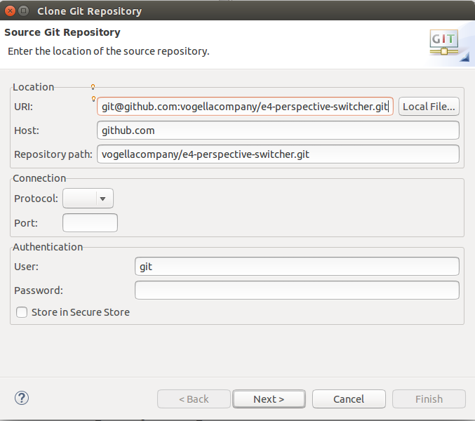

== Exercise: Changing the window title on perspective change

=== Target

In this exercise we will change the window title according to the active perspective.

=== Clone e4-perspective-switcher

In order to have a running example with different perspectives you should clone the e4-perspective-switcher git@github.com:vogellacompany/e4-perspective-switcher.git into a new workspace.

After you cloned the e4-perspective-switcher, you should have 3 projects in your workspace:

* com.sample.application
* com.sample.feature
* org.eclipse.e4.ui.workbench.commands.swt

In the _com.sample.application_ project you can find the _com.sample.application.product_, which you should start in order to see a running example of the e4-perspective-switcher.

=== Add a new model add-on
Now we add a new add-on to the application model, which will be used to listen for the perspective change event.

image::./images/perspective_switch_addon.png[Perspective switch addon,pdfwidth=60%]

The implementation of the `PerspectiveSwitchAddon` looks like this:

[source,java]
----
include::res/perspective_switch_exercise.java[]
----

=== Validate

Start your application again and make sure that you used the _-clearPersistedState_ program argument, so that the new addon is available and active.

The result should look similar to this one, where you can see that the window title has been changed to the name of the currently selected perspective:

image::./images/perspective_switch_addon_result_app.png[Perspective switch addon result,pdfwidth=60%]

