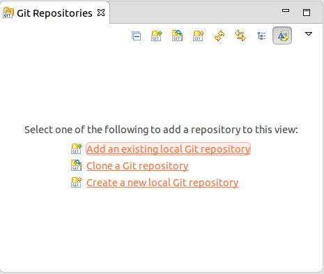
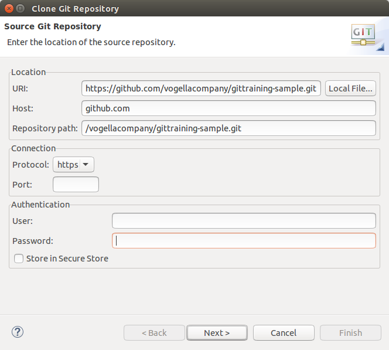
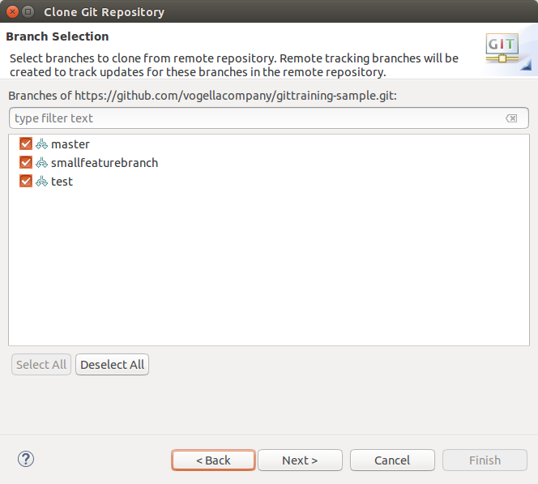
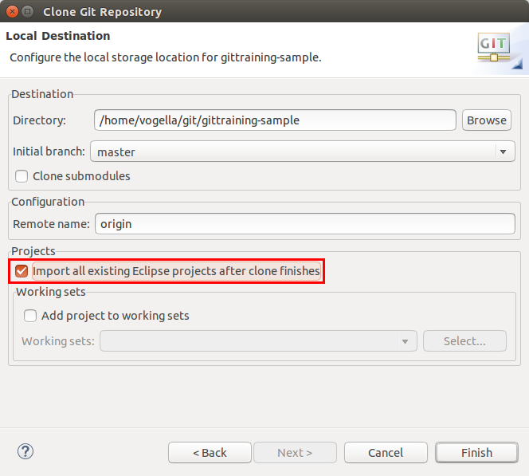
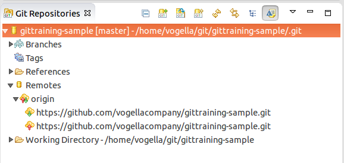
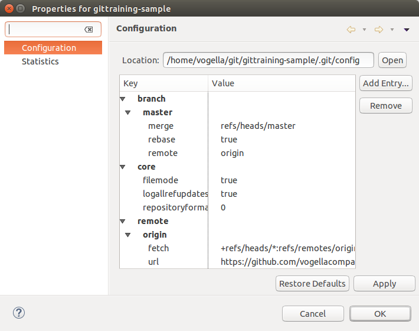

[[eclipsegit_clonecalculatorexample]]
== Eclipse Git exercise preparation

[[clone_the_example_repository_and_import_projects_into_eclipse]]
=== Clone the repository and import the projects into Eclipse

Open the _Git Repositories_	view via the menu:Window[Show View>Other>Git>Git Repositories] menu entry.

		
Click the _Clone a Git repository_ button in this view (see Tooltips for the correct button).

This opens the dialog to clone a Git repository. Enter the following URI in the URI field:
		
https://github.com/vogellacompany/gittraining-sample.git

		
Click the _Next_ button.

On the next page you see the branches in this repository. 
Ensure all branches are selected.
The branches you see may differ from the following screenshot. 
		
		

Click the _Next_ button.

In the _Directory_ field, choose a path where to store the local repository.
		
Make sure the _Import all existing projects after clone finishes_ checkbox is selected and click the _Finish_ button.
		
    

[[get_familiar_with_the_example_project]]

== Get familiar with the example projects

The example repository contains two projects:

* `org.eclipse.example.calc`- contains a simple calculator
* `org.eclipse.example.calc.test` - contains unit tests
				
Both projects contain launch configurations. 
Use them to start the calculator or run the unit tests.
For Mac there is a specific launch configuration with _Mac_ in the name.

image:img/launch-sample-application.png[Launch Sample Application]    		
		
image:img/sample-application.png[Sample application for Git exercise]          
        
[[git_repositories_view]]    		
	
== Analyze the Git repository      

To get an overview of the history of your Git repository, right-click on one of the example projects and select the menu:Show in[Git Repositories] entry from the context menu.
This opens the _Git repository_ view.
        
         

        
Under menu:Remotes[origin] you see the fetch and the push configuration. 
To see more details, right-click on the repository entryand select menu:Show In[Properties].
        
To see the complete repository configuration, select the menu:Properties menu entry from the repository context menu.

  
        
