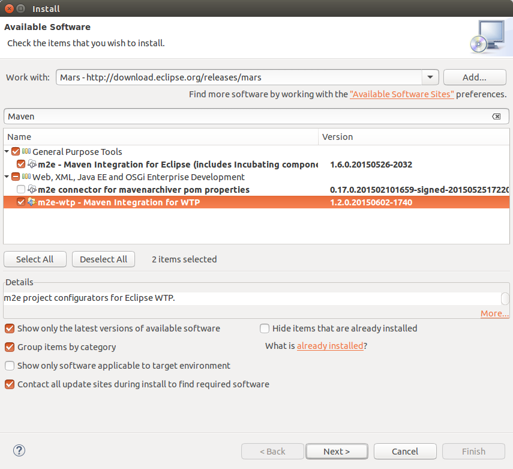
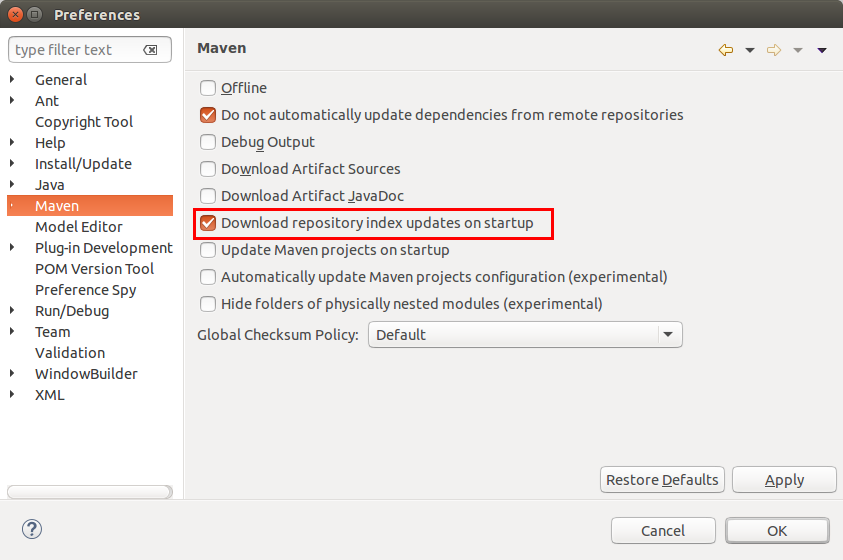

[[maven_eclipseinstallation]]
== Installation and configuration of Maven for Eclipse

[[maven_eclipseinstallation_m2es]]
=== Install the Maven support for Eclipse (m2e)
		
Most Eclipse downloads include the Maven tooling already. 
If it is missing in your installation, you can install it via the main update of your release via menu:Help[Install New Software].
The following listing contains the update site for the Neon release and an update site maintained by the m2e project.
	
[source,xml]
----
// Neon update site
http://download.eclipse.org/releases/neon

// Update site provided by m2e project 
http://download.eclipse.org/technology/m2e/releases
----	

For the usage of Maven for Java projects, you only need the m2e component. 
For Java web development you also want the m2e-wtp entry.
		

[[maven_eclipseinstallation_index]]
=== Download the Maven index
		
By default, the Maven tooling does not download the Maven index for the Eclipse IDE. 
Via the Maven index you can search for dependencies, select them and add them to your pom file. 
To download the index, select menu:Windows[Preferences>Maven] and enable the _Download repository index updates on startup_ option.
		

			
After changing this setting, restart Eclipse. 
This triggers the download of the Maven index. 
You may want to remove this flag after restarting to avoid network traffic at every start of Eclipse.

[NOTE]
====
The m2e team works on a way to dynamically query for dependencies. 
Please register for the following bug to show that you are interested in this development:
https://bugs.eclipse.org/bugs/show_bug.cgi?id=478647[Provide an alternative Artifact search mechanism in Eclipse Maven].
====

