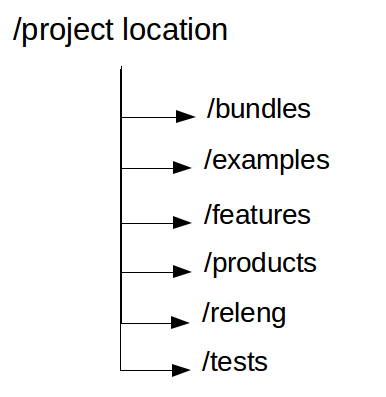

[[maventycho]]
== Using Maven Tycho to build Eclipse components

[[maventycho_overview]]
=== What is Tycho?

_Tycho_ is a set of Maven plug-ins for building Eclipse components via the Maven build system. 
Tycho supports the build process of Eclipse plug-ins, OSGi bundles, Eclipse features and update sites (based on p2) and products.
Combined with a continuous integration server, for example a Jenkins instance, Tycho allows a continuous integration build. 
Tycho uses the Eclipse components metadata as much as possible. 
For example, for plug-ins it determines the dependencies via the _MANIFEST.MF_ file.
		
		
The main Tycho functionality is the `tycho-maven-plugin` plug-in.
This plug-ins supports building Eclipse components. 
It also enables Maven to understand package types such as eclipse-plugin, eclipse-feature and eclipse-repository.
		
To use the Tycho plug-ins you only have to install the Maven build tool. 
The Tycho plug-ins are configured in the pom file and are automatically downloaded and installed by Maven.
		

[[maventycho_dependencymanagement]]

=== Defining dependencies for the build

In your parent pom you can define where Tycho should search for plug-in dependencies of your Eclipse components.
This can be defined via a p2 repository.
		
[source,xml]
----
 <repositories>
    <repository>
      <id>eclipse-mars</id>
      <url>http://download.eclipse.org/releases/mars</url>
      <layout>p2</layout>
    </repository>
  </repositories>
----
		
It is also possible to use a target definition file. 
See <<tychotargetplatform>> <<exerise_tychotargetplatform>> for more information.

		
[[maventycho_typicalconfiguration]]
=== Good practice for Eclipse components organization

To have some separation of the plug-ins a good practice is to have separate folders on the file system for them.
		

		
In a Tycho build it is good practice to create a configuration pom file. 
This file includes the Tycho plug-ins and the definition of the build environment. 
This pom file describes the general configuration.
The folder which contains this build file is typically releng for _Release Engineering_.
		
In addition you create an aggregator build file which lists all Eclipse components which should be built as _modules_. 
The aggregator includes the configuration pom file as parent.
		
And the pom files in the different Eclipse projects contain primary the nature of the component (feature, plug-in, product, update site) and the version number from the MANIFEST.MF.
		
[[maventycho_build]]
=== Starting the build
		
After setting up your pom configuration files, you can build your Eclipse components with  the `mvn clean verify` command, 
or the `mvn clean install` command. 
It is recommended to use the `mvn clean verify` command. 
If the `mvn clean install` command is used, it would result in a build being installed in your local Maven repository and this can lead to build problems.
		
[source,shell]
----
# run this inside the directory of your build
mvn clean verify
----
