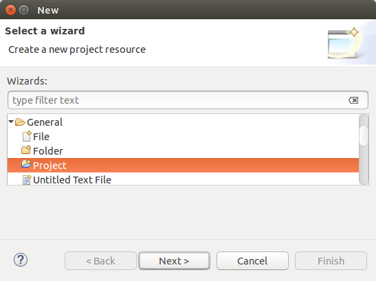

[[exercisetycho_configuration]]
== Exercise: Configure Tycho build

[[exercisetychoplugin_configuration]]
=== Target of this exercise

In this exercise you define the meta data to use pomless builds with Tycho.
		
[[exercisetycho_configuration_rootdirectory]]
=== Create a root project
		
Create a `tycho-example` project as general project in the workspace. 
This root project will contain all your Eclipse components and Maven configuration files.

		
		
This root project is supposed to contain all Eclipse components, which are created in the follow up exercises.
		
[[exercisetycho_configuration_pomless]]

=== Enable pomless Tycho build
		
Create in the root project a _.mvn/extensions.xml_ descriptor. 
The content of the _.mvn/extensions.xml_ must look like the following to enable pomless builds.

[source,xml,subs="specialchars,attributes"]
----	
include::res/polyglot/pomlesstycho-extensions.xml[]
----

[[exercisetycho_configuration_parent]]

=== Create pom for the build configuration
		
Create a new folder called `releng`	in the root project. 
In this folder create a new Eclipse project of type `General` called _com.vogella.tycho.configuration_.
		
Create the following _pom.xml_ file in this project.

[source,xml,subs="specialchars,attributes"]
----	
include::res/components/parent/pom.xml[]
----	

[[exercisetycho_configuration_rootpom]]
=== Create pom in the root project
		
Create the following _pom.xml_ file in the root project of your build.
		
[source,xml]
----	
include::res/components/parent/rootpom.xml[]
----

[[exercisetycho_configuration_validate]]
=== Validate build setup
		
Run the build via `mvn clean verify`, this build should be successful. 
No build artifact is created.
