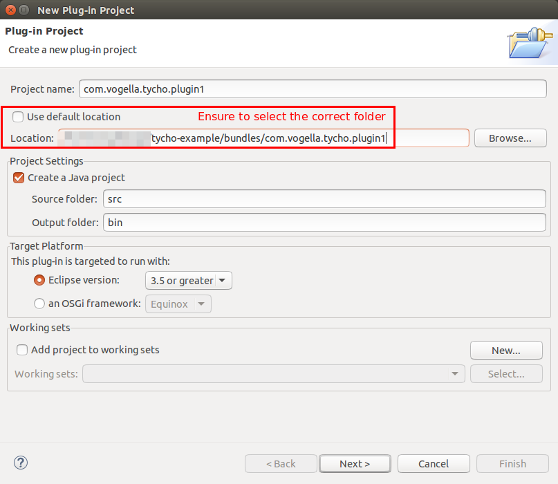

[[exercisetychofeature]]
== Exercise: Tycho build for Eclipse features

[[tychofeaturesexercise_target]]
=== Target of this exercise
		
The following description demonstrates how to build Eclipse features with Maven Tycho. 
It is based on <<exercisetychoplugin>>.
		
[[tychofeaturesexercise_featurecreate]]		
=== Create feature to build

Create a new feature project called _com.vogella.tycho.feature_ which includes the _com.vogella.tycho.plugin1_ plug-in.

[[tychofeaturesexercise_create]]
=== Create pom for feature folder

Create the following pom in the _features_ directory.

[source,xml]
----
include::res/components/parent/featurespom.xml[]
----

[[tychofeaturesexercise_createfeaturespom]]
=== Create a feature pom
		
In the _features_ folder, create the following pom file.

[source,xml]
----
include::res/exercise/feature/pom.xml[]		
----

[[tychofeaturesexercise_addfeaturetoroot]]		
=== Add feature to root pom

[source,xml]
----
include::res/components/parent/rootpomwithfeatures.xml[]     
----

[[plugin_featurerun]]
=== Run build build
		
Select the root pom and run your build. This should work fine.

[source,shell]
----
include::res/exercise/feature/successmessage.txt[]     
----
		
[NOTE]
====		
Building the feature (from the features directory) will not work, as this requires com.vogella.tycho.plugin1 to be present in one of the repositories specified as dependency. 
If an independent build of the feature is required, you need to make the plug-in available via a repository. 
This can for example be done by building and installing the plug-in into the local Maven repository with the `mvn clean install` command.
====

[source,shell]
----
include::res/exercise/feature/errormessage.txt[]     
----	

[[plugin_aggregatorrun]]
=== Run aggregator build and validate the feature build result
		
Select the pom of your aggregator and run the build. 
It should complete and build all your components.

Press F5 in the Eclipse IDE on your feature project to refresh it. 
You find a new _target_ folder in your project which contains the JAR file for your feature.
		
The JAR file still has the SNAPSHOT suffix. 
This suffix is replaced with the build time stamp once you build a product or an update site with the `eclipse-repository` packaging type.
		