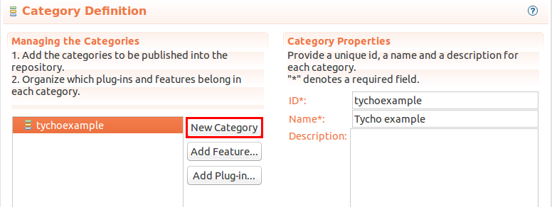
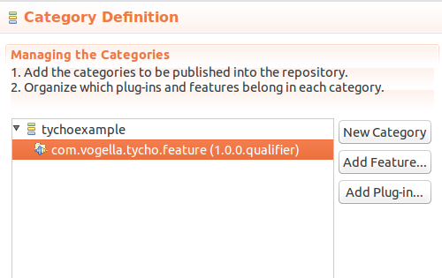

[[exercise_tychoupdatesite]]
== Exercise: Tycho build for update sites

[[exercise_tychoupdatesite_target]]
=== Target of this exercise
		
The following exercise demonstrates how to build Eclipse update sites with Maven Tycho. 
It is based on the  <<exercisetychoplugin>> and <<exercisetychofeature>> exercises.
		
[[exercise_updatesite_categorydefinition]]
=== Create a category definition file for the update site

In your _releng_ folder, create a new project of type _General_.
It should be called _com.vogella.tycho.update_.
			
Select the main folder of this project and select File[New > Other...>Plug-in Development>Category Definition].
		
Press the _New Category_ button and create a new category with the "tychoexample" ID and "Tycho example" name.

		
Press the _Add Feature..._ button and include your feature project into the category.
		
[]

[[exercise_updatesite_updatepom]]
=== Create pom file for the releng folder

Create the following pom file in the releng folder.

[source,xml]
----
include::res/exercise/updatesite/releng.xml[]     
----

[[exercise_updatesite_pom]]
=== Create pom for the update site

Create the following pom file for your update site project.

[source,xml]
----
include::res/exercise/updatesite/updatesitepom.xml[]     
----

[[exercise_updatesite_aggregator]]
=== Update the root poj
		
Add your new module to your root pom file.

[source,xml]
----
include::res/components/parent/rootpomwithupdatesite.xml[]     
----

[[exercise_updatesite_aggregatorrun]]
=== Run aggregator build and validate the update site build result
		
Select the pom of your aggregator and run the build. 
It should complete and build all your components including sthe update site.

Press F5 in the Eclipse IDE on your update site project to refresh it. 
You find a new _target_ folder in your project which contains a _repository_ folder. 
This folder contains the update site.
		
Validate that the JAR files in the "repository" have the SNAPSHOT suffix replaced with the build qualifier.
		
