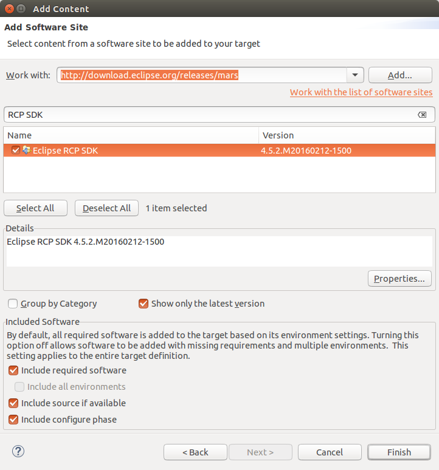

[[exerise_tychotargetplatform]]
== Exercise: Using a target platform for the build

=== Create project and target definition file

	
Create a new project of type _General_ in the _releng_ folder called _com.vogella.tycho.target_.

Right-click on the new project and select the menu:New[Other>Plug-in Development>Target Definition] menu entry. Name the file _com.vogella.tycho.target.target_.

WARNING: The name is actually important. It must be the name of the Maven artifact id followed by .target.
    
Add at least the _Eclipse RCP SDK_ to your target definition file.

[NOTE]  
====
Activate the target definition file in the Eclipse IDE. 
Of course, Tycho requires that the target platform definition actually works for development. 
If you have compile errors after activation in the Eclipse IDE, it will also not work for the automatic build.
====

=== Create pom file for the target definition file

Create in a pom file to your _com.vogella.tycho.target_ project.
	
[source,xml]
----
include::res/target2/pom.xml[]     
----        

=== Update releng and configuration pom

Add the new project to your aggregator pom file

[source,xml]
----
include::res/target2/relengpomwithtargetproject.xml[]     
---- 	
	

Finally activate the usage of the target platform. 

[source,xml]
----
include::res/target2/configurationwithtarget.xml[]     
----    	

<1> This block activates the usage of the target definition file

